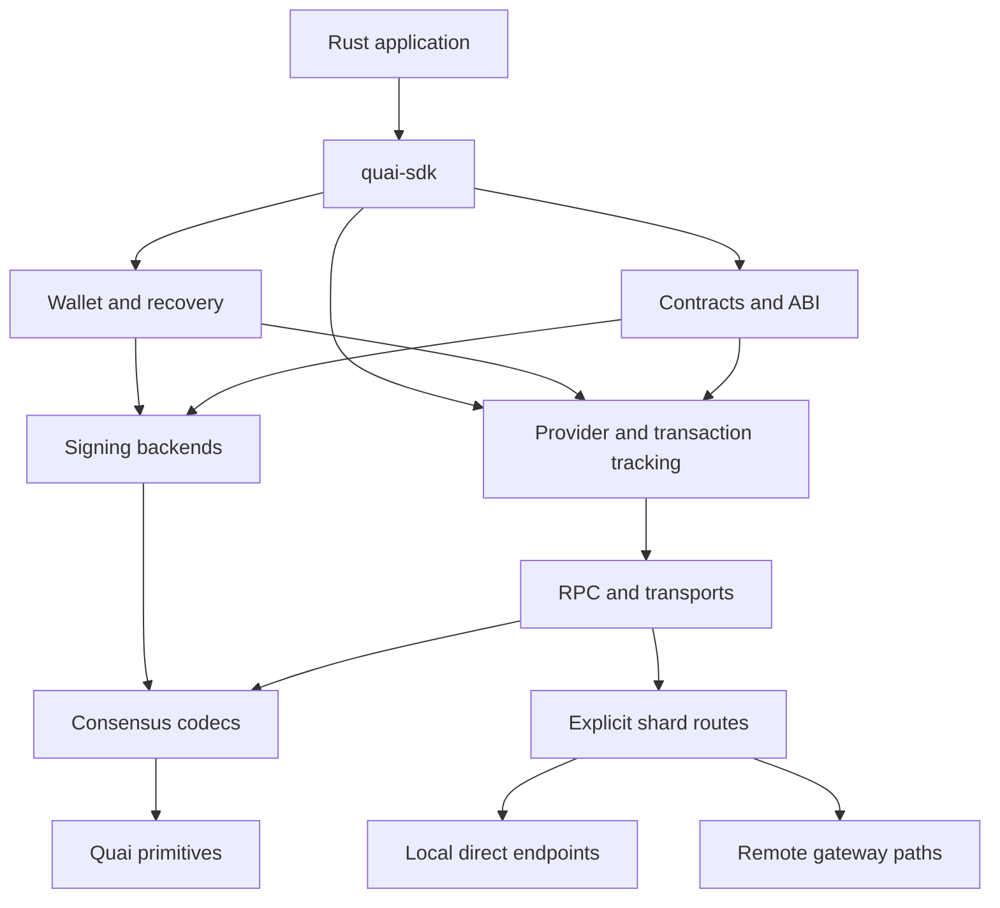

# Quai Rust SDK buildout and publishing plan

## Recommendation

Build an idiomatic Rust SDK with independently verified Quai protocol types, codecs, routing, signing, and wallet state. Reuse maintained Rust libraries for cryptographic primitives, integer arithmetic, ABI encoding, and networking. Treat quais.js as the application compatibility reference and go-quai as an independent protocol reference; establish compatibility against specific versions of both.

The release must cover both the account-based Quai ledger and the UTXO-based Qi ledger. A provider plus an account wallet is an early milestone, not feature completion. Qi recovery, payment codes, multi-input signing, conversions, contract address grinding, subscriptions, and multi-shard routing belong in the full buildout.

Use explicit endpoint configuration. For the required local connection, `usePathing: false` means **preserve the supplied URL**, including its port and existing path. In JavaScript this is the boolean `false`, not the string `'false'`. Rust should expose typed routing modes and provide a compatibility option for this boolean.

A provisional planning scenario is **28–40 calendar weeks with three experienced Rust/protocol engineers, dedicated QA support, and an independent security review**, subject to the early feasibility gates below. This is not yet a dependency-validated delivery forecast. Local activation/funding constraints and the specific JS/node conversion incompatibility identified below can materially change it. Re-estimate after proving Qi signing compatibility and a usable mature local network. Release a clearly scoped alpha earlier; reserve 1.0 for demonstrated completion and stability.

The accompanying [in-depth audit](QUAI_RUST_SDK_AUDIT.md) records the source findings, offline reproductions, corrections and remaining qualification work. This plan incorporates those corrections. “Corrected in the plan” does not mean implemented or verified in Rust.

## 1. Scope, baseline, and evidence

### 1.1 Definition of completion

“Feature complete” means every externally accessible capability in the pinned quais.js package has one of the following dispositions, with a test and documentation reference:

1. An implemented, behaviorally compatible Rust API.
2. An idiomatic Rust equivalent, such as streams instead of JavaScript event listeners or typed ABI bindings instead of dynamic properties.
3. A platform-specific implementation, such as an optional WASM adapter for injected browser wallets.
4. A documented upstream defect or nonfunctional API, with a deliberate Rust behavior and regression test. This disposition cannot conceal a missing working feature.

Optional Cargo features control dependency cost; they do not remove capabilities from the completion requirement. Browser integration remains required for unqualified parity with the full package. A native-only release must say so explicitly.

Additional go-quai administration, mining, GraphQL, explorer, hardware-wallet, and third-party extension functionality is a separate extension backlog unless the package inventory proves it is part of the pinned SDK surface. Do not describe stock Ethereum APIs as supported simply because their names appear in inherited comments.

### 1.2 Inspected versions

The following baseline was inspected on **2026-09-11**. The starting workspace contained no Rust implementation, Cargo manifest, or existing documentation.

| Component | Observed baseline | Use in this project |
|---|---|---|
| Published `quais` npm package | `1.0.0-alpha.57`; registry `gitHead` `3bd0bf5b077f4aa5fab480474e3982e50e1af506` | Published artifact is the initial JS application reference. |
| quais.js source checkout | `94e32c7eb9960de36054135c40a341c44c84f922`; commit dated 2026-08-28; package version `1.0.0-alpha.57` | All 153 source files shipped in the verified npm tarball match this checkout byte-for-byte. Generated runtime equivalence remains a separate check. |
| go-quai source checkout | `f3f345c877300c044e3e0081a48bf3cf786fb9cc`; version `v0.56.0`; commit dated 2026-09-09 | Candidate node reference. Compatibility with the npm release must be established, not assumed. |
| Public test network | Orchard, documented chain ID `15000` | Public integration testing. |
| Local network | Documented chain ID `1337` and per-shard ports | Verify against the actual genesis/configuration used by the harness. |

The npm artifact integrity is:

```text
sha512-asseq9pWXSwr9+FNOsIa7e4H4b+tKSIDOVh16xjwAtzqNS9zYsYAQak/OJzMKbvehzgurqF/7GcTOQb9RrYt1Q==
```

These are observations, not interchangeable version identifiers. The npm `gitHead` and checked-out HEAD differ, but the audit downloaded the tarball, verified the stated SHA-512 integrity, and found all 153 shipped `src/` files identical to the checkout, with no differing or missing shipped source files. Its SHA-256 is `d45104f6db1b185cecb6765560c79e7dd924a835d2c7420049af53bd79030bde`. Phase 0 still needs a retained oracle dependency lock, generated-build/export verification, and node-acceptance evidence. Upstream's README also retains a development-status warning; copying its behavior alone cannot establish production readiness.[^1][^2][^3]

### 1.3 Verified network observations

Three read-only requests on 2026-09-11 at approximately 19:55 UTC returned:

| Endpoint | Method | Result |
|---|---|---|
| `https://orchard.rpc.quai.network/cyprus1` | `quai_chainId` | HTTP 200, `0x3a98` = `15000` |
| `https://orchard.rpc.quai.network/cyprus1` | `quai_blockNumber` | HTTP 200, `0x76be98` |
| `https://orchard.rpc.quai.network/prime` | `quai_listRunningChains` | HTTP 200, `[[0,0]]` |

These observations establish endpoint reachability and the reported topology at that moment. They do not establish sustained availability, the deployed node version, WebSocket support, wallet correctness, or transaction acceptance. No wallet was funded, no transaction was broadcast, and no local node was started for this plan.

Official network documentation currently identifies Cyprus-1 as the only active public zone. Orchard HTTPS/WSS endpoints are `/cyprus1`, its faucet is `https://orchard.faucet.quai.network`, and its explorer is `https://orchard.quaiscan.io`. Full multi-zone tests therefore require a local or dedicated controlled network.[^4]

### 1.4 Existing Rust ecosystem

The public package/repository searches performed did not identify an established, feature-complete Quai Network Rust SDK to adopt. This is a bounded discovery result, not proof that no private or obscure implementation exists. The crate name **`quai` is already occupied by an unrelated query REPL**. Use the repository name `quai-rust-sdk` and provisionally name the facade crate `quai-sdk`, subject to registry availability and ownership checks.[^24]

## 2. Findings that change the implementation plan

| Finding | Evidence and implication |
|---|---|
| Quai is not an Ethereum transport alias | The SDK uses `quai_` methods and distinct transaction/response models. Namespace rewriting around a stock Ethereum provider is insufficient.[^5] |
| Local no-path mode preserves URLs | The inspected HTTP and WS constructors bypass suffix construction when pathing is false. A single endpoint defaults to Cyprus-1. Do not infer that false automatically discovers or rewrites all local shard ports.[^6] |
| Public discovery is hierarchical | Path mode bootstraps a Prime route and queries `quai_listRunningChains`. Static explicit routes are needed when a gateway only exposes a zone.[^6] |
| Transaction wire encoding is protobuf | The JS encoder serializes `ProtoTransaction`. Preserve field presence, integer encoding, list order, and signing exclusions; generic Ethereum RLP envelopes are unsuitable.[^7] |
| Transaction ID differs from an ordinary digest | Both transaction classes apply location/ledger-related byte modifications after hashing. Signing digest, serialized transaction, and transaction ID must be different concepts.[^8] |
| CREATE address derivation differs | The inspected helper hashes sender bytes, an eight-byte big-endian nonce, and deployment data. Contract deployment searches a suffix in the deployment data for a suitable address.[^9] |
| Qi needs more than ordinary Schnorr support | Single-input signing uses Schnorr; multiple inputs use MuSig aggregation. Node verification uses ordered input public keys and aggregation with sorting disabled. Candidate Rust libraries must match this behavior.[^10] |
| Wallet state is substantial | QiHDWallet includes BIP44 derivation, BIP47 payment channels, private-key imports, scanning, synchronization, aggregation, conversion, and serialization. Port recovery semantics as well as send operations.[^11] |
| Source comments can contradict implementation | `MessagePrefix` is actually `\x19Ethereum Signed Message:\n`, despite its adjacent Quai-prefix description. Pin this in vectors rather than “correcting” it from the comment.[^12] |
| Protocol schemas already differ | The inspected JS and Go `ProtoHeader` fields diverge: for example, field 33 is `secondary_coinbase` in JS and `exchange_rate` in Go. Transaction fields inspected align more closely, but this does not establish full schema compatibility.[^7] |
| The documented local runner is unavailable | `dominant-strategies/quai-local-node` returned repository-not-found/404. Current docs and JS container scripts still reference it. Budget for maintaining an owned harness.[^13] |
| Test fixtures provide a substantial starting point | The checkout contains ABI, crypto, transaction, wallet, Qi scan/send/conversion, and serialization fixtures. Audit and port them, then add independent adversarial and node tests.[^14] |

Two further discrepancies deserve explicit adjudication. The general `getTxType` helper returns `1` for a Qi-to-Quai address pair, while go-quai distinguishes Quai, external, and Qi wire transaction types as `0`, `1`, and `2`. Conversion construction must follow its real transaction path rather than blindly equating that helper's result with a user-signable wire envelope. Also, the inspected contract grinding loop returns its last transaction after 10,000 unsuccessful attempts. Rust should return a typed exhaustion error and never broadcast an address candidate that fails the required scope checks.[^8][^9]

Maintain `docs/upstream-discrepancies.md`. Each entry needs source locations, pinned versions, an executable reproducer, observed JS behavior, independent node evidence where applicable, and the chosen Rust behavior. Never turn an unresolved consensus/signature discrepancy into an automatic fallback.

The deeper audit adds the following **named compatibility blockers**, beyond the initial findings:

| Area | Verified finding | Required disposition |
|---|---|---|
| HD backup | The legacy format omits mnemonic passphrase/wordlist; a passphrase-bearing Quai wallet restored to a different xpub in an offline reproduction. French restore failed; seed-only export threw. | Separate lossless native backups from restricted legacy interchange; reject lossy exports. |
| Imported Qi secrets | The JS address record stores the private key in `derivationPath`, including returned/exported metadata. | Secret adapter only; use opaque key identifiers in public Rust records. |
| Payment-code imports | Imported channel destinations are not fully re-derived before reuse. | Verify address/public-key derivation for every imported branch before publishing state. |
| Qi restore | Export contains checkpoints without their UTXO snapshot. | Invalidate metadata-only checkpoints and rescan before reporting spendability. |
| Conversion | Default JS Qi-to-Quai construction omits the 22-byte payload expected by the pinned Go validator; its estimator also omits the supplied data. | Typed conversion encoding and identical estimate/sign payloads; qualify the exact node profile. |
| Qi lifecycle | Small denominations can be trimmed; aggregation into larger denominations has a first-Qi-transaction-in-block restriction. | Explicit expiry accounting and inclusion-position tests. |
| Topology | JS expansion helpers and Go's expansion dimensions disagree. | Use discovery and the chosen protocol schedule; retain discrepancy vectors. |
| Local execution | Fresh-chain gas/state limits and fixed genesis allocation checks prevent assuming immediate funded writes. | Prove a mature, funded harness and record activation state. |

The offline reproductions establish JS behavior only. The candidate Go conversion mismatch, topology rules and transaction constraints are supported by source inspection; they have not been demonstrated against the deployed Orchard node.[^27][^28][^29][^30]

## 3. Architecture and dependency strategy

### 3.1 Recommended package boundaries

Use a Cargo workspace with a small facade and seven substantive libraries. Keep internal modules private until their API is stable; avoid a separate crate for every source directory.

| Package | Responsibility | Dependencies within workspace |
|---|---|---|
| `quai-primitives` | Addresses, ledger/location types, hashes, amounts, quantities, access lists, validated basic structures | None |
| `quai-consensus` | Quai/Qi/external transaction representations, protobuf codecs, signing preimages, transaction IDs, versioned block/work-object types | Primitives |
| `quai-rpc` | RPC request/response DTOs, transport interface, HTTP/WS implementations, route resolution, capability discovery | Primitives, consensus |
| `quai-provider` | High-level reads, typed errors, polling/subscriptions, receipt/ETX tracking, transaction preparation | RPC, consensus, primitives |
| `quai-signer` | Digest signing traits, local key implementation, ECDSA/Schnorr/MuSig backend boundary, message and typed-data signing | Consensus, primitives |
| `quai-wallet` | HD derivation, keystores, Quai/Qi wallets, coin selection, reservation and recovery state | Signer, provider, consensus, primitives |
| `quai-contract` | ABI integration, static and dynamic calls, events, deployment and address grinding | Provider, signer, consensus, primitives |
| `quai-sdk` | Documented facade and feature selection | Re-exports of the above |
| Internal `xtask`, test support, JS/Go oracles | Verification, integration harness, release checks | `publish = false` |

The exact names remain provisional. If Phase 0 finds excessive publishing or dependency overhead, combine RPC and provider into one published package while retaining the internal boundary.



### 3.2 Dependency choices and feasibility gates

| Area | Recommended starting point | Acceptance condition |
|---|---|---|
| Integers/bytes/ABI | Selective `alloy-primitives`, `alloy-sol-types`, `alloy-dyn-abi`, `alloy-json-abi` | Verify ABI parity, supported integer widths, feature cost, and dependency/MSRV compatibility. |
| Full provider abstraction | Quai-owned implementation; evaluate an optional Alloy adapter | An adapter must preserve namespace, protobuf semantics, transaction hashes, hierarchy, and Qi types. Do not fabricate Ethereum envelope traits to satisfy bounds. |
| ECDSA/ECDH/Schnorr | Evaluate `k256` and Rust `secp256k1` bindings | Compare vectors, constant-time guarantees on supported targets, recovery IDs, low-S rules, WASM feasibility, build requirements, and performance. |
| MuSig | Evaluate `musig2` against pinned JS and Go behavior | Matching aggregate keys, signing preimages, public-key order, nonce/session rules, signatures accepted by go-quai, independent review. |
| Mnemonics/HD | `bip39`, `bip32`, with Quai-specific derivation logic | Match coin types, multilingual normalization, xpub/xprv serialization, skipped/grinded child indices, and payment codes. |
| Protobuf | `prost`, with checked-in generated code and explicit domain conversion | Exact transaction vectors; presence of optional zero values; unknown-field policy; no consumer-side code generation/network access. |
| Networking/runtime | Tokio, `reqwest` with rustls, a maintained WS client, `url`, `serde` | Typed transport interface, bounded resources, cancellation, TLS verification, target support; select exact versions during Phase 0. |
| Secrets | `zeroize` and a narrow secret-wrapper interface | No secret `Debug`, implicit serialization, casual copies, or accidental tracing; inspect backend storage too. |

Alloy offers reusable modular primitives and ABI facilities. Its custom `Network` abstraction is useful evidence for an adapter design, but is not proof that Quai's protocol fits all its trait assumptions. `ethers-rs` is deprecated in favor of Alloy and Foundry, so it should not be the base of a new long-lived SDK.[^15][^16]

Both `k256` and `secp256k1` expose ECDSA and Schnorr functionality. Neither fact proves compatibility with Quai's complete signing construction. Likewise, the existence of a Rust MuSig implementation does not establish identical key aggregation or nonce protocols.[^17] BIP32/BIP39 libraries provide building blocks rather than Quai-aware wallet recovery.[^18]

Use `bip39` for multilingual mnemonic parsing and seed construction, then feed the seed into BIP32 derivation. Do not accidentally substitute a BIP32 crate's more limited mnemonic convenience API for the promised wordlist/phrase-length support.

Commit exact development resolutions in `Cargo.lock`; use reviewed compatible version ranges for published libraries. Test fresh downstream dependency resolution separately, because a library workspace lockfile does not lock dependencies for every consuming application. Record direct and transitive dependencies, licenses, supported targets, build scripts, and advisories.

### 3.3 API design rules

- Distinguish `Address`, validated `QuaiAddress`, `QiAddress`, `Zone`, `Region`, and hierarchical `Location`. Parsing a valid address and determining whether its zone is active are separate operations.
- Represent monetary amounts with integer-backed newtypes. QUAI formatting uses 18 decimal places and Qi uses 3 in the reference. Reject floating-point input, overflow, negative transfers, and excess precision.[^12]
- Keep signing synchronous where it is pure CPU work and provide bounded asynchronous wrappers for slow derivation, KDFs, and aggregation. Do not block Tokio executor threads.
- Separate read providers, transaction preparation, and authorization. Providers do not gain key access implicitly.
- Expose immutable prepared transactions with chain identity, sender/inputs, recipients, fees, and codec version. Signing consumes or validates that exact preparation.
- Use distinct `SigningDigest`, `TransactionId`, and serialized-envelope types. Raw “sign any hash” belongs in an explicitly low-level interface.
- Preserve RPC error codes and structured data while mapping useful categories: timeout, transport, chain mismatch, unavailable shard, capability missing, nonce conflict, execution revert, insufficient funds, UTXO conflict, and ambiguous broadcast.
- Unknown response fields can be retained for forward compatibility; unknown signing/wire transaction variants must fail closed. Do not silently deserialize missing financial fields as zero.
- Expose cancellation and deadlines for scans, subscriptions, waits, and grinding. Support explicit shutdown and clean resource release.
- Provide structured progress callbacks without secrets; avoid copying JS callbacks that exist only to yield its event loop.

### 3.4 Targets and features

The initial primary runtime is native Rust with Tokio. Establish Linux x86_64 and aarch64 execution tests, Windows x86_64, and macOS arm64 CI; add other targets only when their evidence supports a claim. Validate WASM cryptography and browser transport separately. Do not require native `Send` bounds for JavaScript browser objects.

Proposed facade features: `http`, `ws`, `wallet`, `qi`, `contracts`, `keystore`, `wordlists-all`, and `browser`. Keep `browser` and native transport configurations compatible with their actual target requirements. Default to a useful account SDK configuration, with the complete documented bundle available explicitly. Defer an unconditional `no_std` promise; pursue it for primitives/codecs if dependency gates succeed.

Set and test `rust-version` after choosing dependencies. Maintain an MSRV policy, a pinned development toolchain, and separate stable/nightly jobs. Do not select a historical MSRV that current dependencies cannot support.

Before stabilizing provider/wallet traits, prove a minimal browser slice: a read request with bounded timeout/cancellation, an injected authorization/signature request, and a CPU-heavy derivation with a defined worker or cooperative execution policy. Define target-specific task, clock/timer, cancellation and storage adapters. Native Tokio networking/filesystem/thread-pool assumptions must not leak into the browser interface; browser request timeouts cannot rely on native-only client settings. Browser durable storage needs its own atomicity contract or an explicit application-provided implementation. Cargo features must remain additive under feature unification; use target-specific implementations or separate browser types rather than toggling public trait bounds globally. Full browser parity may finish in Phase 6, but this feasibility gate belongs in Phase 0/2.[^31]

## 4. Feature parity work breakdown

This is the implementation scope matrix. Phase 0 expands it into a machine-readable symbol-and-method inventory covering package root exports, all supported subpath exports, public class members, types, overload behaviors, and examples. The npm package exposes more than the root export list; for example, `AggregateCoinSelector` is exported by the transaction submodule.[^2][^14]

| ID | Capability | Required Rust result and acceptance evidence |
|---|---|---|
| P01 | Constants and chain hierarchy | All reference ledgers, shards, zones, conversions, and boundary cases; active topology kept separate from possible topology. |
| P02 | Addresses | Validation, checksum formatting, public-key address derivation/recovery, address-like resolution, scope tests, CREATE/CREATE2 address calculations. |
| P03 | Data and numeric utilities | Hex, bytes, base58/base64, UTF-8 policies, bytes32, quantity encoding, signed/unsigned bounds, fixed-point operations and unit formatting. Map JS coercions to explicit checked conversions. |
| P04 | Hashing | Keccak, SHA families, RIPEMD160, HMAC, identifiers, packed Solidity hashing, personal messages, typed data. |
| P05 | Cryptographic utilities | Randomness, signatures, signing keys, PBKDF2/scrypt, synchronous/asynchronous interfaces, and supported backend customization through Rust traits. |
| P06 | Mnemonics and ordinary HD nodes | Entropy/phrase/seed round trips, passphrases, normalization, extended keys, public-only nodes, all ten listed wordlists including Portuguese and both Chinese variants. |
| P07 | Quai HD wallet | Coin type `994`, accounts, zone/ledger-constrained address derivation, key lookup, message/typed-data signing, serialization/import and send. |
| P08 | Quai transactions | Populate, sign, encode/decode, clone/equality equivalents, hash, broadcast, fee handling, nonce management, wait/replace behavior. |
| P09 | Qi transactions | Inputs/outputs, outpoints, denomination table, locks, protobuf, digest, single-input Schnorr, multi-input MuSig, IDs and node acceptance. |
| P10 | Qi HD wallet | Coin type `969`, receive/change indices, zone/account state, scan/deep scan/sync, spendable/locked/trimmed accounting, imported keys and historical-use versus current-UTXO status. |
| P11 | Payment codes | BIP47 codes, validation, channel opening, send/receive address derivation, account/zone filtering, backup/restore, interoperability with the JS wallet. |
| P12 | Coin selection | Fewest-coin selection, aggregation, conversion selection, fee convergence, change, insufficient funds, limits, deterministic compatibility mode. |
| P13 | Wallet persistence | Lossless native backup, explicitly supported JS interchange subset with lossy-export rejection, derivation-validated import, encrypted storage, atomic checkpoint/snapshot generations and recovery tests. |
| P14 | HTTP RPC | Requests, ID matching, batches, timeouts, safe retries, cancellation, custom headers, route-specific clients and capability detection. |
| P15 | WebSocket RPC | Connection lifecycle, per-route subscriptions, reconnect, resubscribe, backfill, bounded queues and shutdown. |
| P16 | Provider reads | Blocks, pending headers, transactions including external transactions, receipts, balances, storage, code, logs, outpoints, txpool and conversions. |
| P17 | Response objects | Preserve block/header/work-object structure, lazy/prefetched transactions, JSON representations and typed follow-up operations. |
| P18 | Transaction lifecycle | Replacement detection, confirmation counts, timeout, reorg handling, ETX source/destination tracking, broadcast ambiguity reconciliation. |
| P19 | Contracts | Static ABI bindings and runtime ABI interfaces; overloads, tuples/arrays, errors, events, fallback/receive, populate/simulate/send. |
| P20 | Contract deployment | Constructor encoding, grind-before-sign, correct address scope, access list/fee recalculation, deployment wait and code verification. |
| P21 | Browser/injected providers | Optional WASM bridge for EIP-1193/Pelagus-style requests, shard arguments, account authorization, events and signer behavior. |
| P22 | Signer variants | Local key signer, watch-only/void signer and explicit node-managed signer for the methods actually exposed upstream. |
| P23 | Events and extension interfaces | Stream/listener equivalents, filter lifecycle, orphan/removed events, custom provider/transport/signing implementations. |
| P24 | Examples and error compatibility | Every relevant upstream example mapped to a Rust example/test; stable error categories and a JS-to-Rust migration table. |

Each inventory entry contains `reference_version`, `module`, `symbol`, `behavior`, `rust_api`, `feature`, `status`, `test_ids`, `docs`, and `deviation`. CI rejects newly discovered or removed reference exports without review. Completion requires every working in-scope behavior to be implemented and verified; counting only implemented items in the denominator is prohibited.

## 5. RPC and routing specification

### 5.1 Public routing model

Provide three explicit modes:

```rust
// Proposed API shape; this code does not exist yet.
enum Routing {
    Direct { endpoint: url::Url, shard: Shard },
    Gateway { base: url::Url, paths: ShardPaths, discovery: Discovery },
    Explicit { endpoints: ShardEndpoints },
}
```

`use_pathing(false)` maps to a direct endpoint for the explicitly selected shard, defaulting to Cyprus-1 only in the documented JS compatibility constructor. `use_pathing(true)` maps to gateway path construction. Multi-shard local networks use `Explicit`, with individual HTTP and WS URLs. Do not silently switch between modes after an error.

Configuration loaded from an environment variable is text. Parse exactly supported boolean strings into a boolean, then reject malformed values. The text `"false"` must never pass through JavaScript truthiness or a “nonempty means true” parser.

### 5.2 Endpoint examples

| Profile | HTTP | WebSocket | Mode and expectation |
|---|---|---|---|
| Local Cyprus-1 | `http://127.0.0.1:9200` | `ws://127.0.0.1:8200` | Direct, pathing false; preserve the endpoint. Ports are documented defaults, not guaranteed local configuration. |
| Orchard gateway | `https://orchard.rpc.quai.network` | `wss://orchard.rpc.quai.network` | Pathing true; explicit `/prime` bootstrap and `/cyprus1` zone route. |
| Orchard exact zone | `https://orchard.rpc.quai.network/cyprus1` | `wss://orchard.rpc.quai.network/cyprus1` | Direct, pathing false; do not append another suffix. |
| Custom reverse proxy | `https://node.example/rpc` | `wss://node.example/ws` | Explicit path templates, such as `/rpc/cyprus1` and `/ws/cyprus1`. |
| Local multi-zone | One full URL per enabled shard | One full URL per enabled shard | Explicit map; use actual runtime ports. |

Matching JS reference configurations:

```javascript
const local = new quais.JsonRpcProvider(
  'http://127.0.0.1:9200', undefined, { usePathing: false }
);
const orchard = new quais.JsonRpcProvider(
  'https://orchard.rpc.quai.network', undefined, { usePathing: true }
);
const orchardDirect = new quais.JsonRpcProvider(
  'https://orchard.rpc.quai.network/cyprus1', undefined, { usePathing: false }
);
```

Proposed integration profile format:

```toml
# Illustrative configuration for the future harness.
[profiles.local]
http_url = "http://127.0.0.1:9200"
ws_url = "ws://127.0.0.1:8200"
use_pathing = false
shard = "cyprus1"
expected_chain_id = 1337

[profiles.orchard]
http_url = "https://orchard.rpc.quai.network"
ws_url = "wss://orchard.rpc.quai.network"
use_pathing = true
expected_chain_id = 15000
```

Add the expected genesis hash when establishing each environment. A shared chain ID alone is insufficient to distinguish reset or independently created local networks. Key wallet state and endpoint caches by chain identity, including genesis, and shard.

Genesis pinning is an endpoint/state-isolation check, not an additional field in the existing signed transaction format. Do not claim it prevents on-chain replay between two networks sharing the same signing domain. Offline signing requires an explicitly selected profile; any replay-protection claim must be supported by the actual signed fields.

### 5.3 Route construction and selection rules

1. Parse URLs with a URL library. Preserve approved base prefixes, query parameters, ports, and authentication context; append a shard path once. Reject ambiguous already-suffixed gateway URLs with actionable diagnostics.
2. Direct mode leaves existing paths and ports unchanged. Never convert local port 9200 to Ethereum port 8545 or append `/cyprus1` automatically.
3. Construct discovery and zone paths independently from an immutable base. Include a regression against accidentally deriving `/prime/cyprus1` after changing the bootstrap URL.
4. Route account queries from validated address scope. Route transaction submission from the origin, not the recipient. Route hash lookups using verified Quai hash-location rules or an explicit shard when ambiguous.
5. Group batches by route, chain identity, and authentication context. Match responses by request ID, including out-of-order and partially failed batches.
6. When discovery is unavailable, accept a configured static topology. A missing shard yields `ShardUnavailable`, never a fallback to an unrelated endpoint.
7. Keep HTTP and WS path mappings independent; infrastructure often mounts them differently. Reconnection must reuse the same route policy and revalidate chain identity.
8. Validate discovered locations as protocol location data. Discovery must not cause arbitrary URL fetches or cross-host credential forwarding.
9. Detect capability failures separately from authentication, rate-limit, transport, and malformed-response failures. An unavailable privileged RPC does not make the node unusable for account reads.
10. Preserve origin and destination in cross-zone operations. Source inclusion does not mean destination execution has completed.

Freeze expansion vectors separately from named-zone enums. The pinned Go hierarchy dimensions for expansion values 0–4 are `1×1`, `1×2`, `2×2`, `2×3`, and `3×3`; the JS region/zone helper schedules differ. Tests must cover those disagreements and unknown/future locations. Running-chain discovery describes what an endpoint serves; theoretical expansion dimensions do not prove every chain is running.[^30]

### 5.4 Minimum method mapping

The following methods are present in the inspected JS provider mapping. Parameters and optional/null behavior must be captured from the actual reference, not reconstructed from Ethereum documentation.[^6]

| API family | RPC method(s) | Route |
|---|---|---|
| Chain identity/topology | `quai_chainId`, `quai_listRunningChains`, `quai_getProtocolExpansionNumber` | Configured bootstrap or explicitly appropriate hierarchy context |
| Block reads | `quai_blockNumber`, `quai_getBlockByNumber`, `quai_getBlockByHash`, `quai_getPendingHeader` | Explicit shard/context |
| Account state | `quai_getBalance`, `quai_getLockedBalance`, `quai_getTransactionCount`, `quai_getCode`, `quai_getStorageAt` | Address zone |
| Gas and execution | `quai_gasPrice`, `quai_call`, `quai_estimateGas`, `quai_createAccessList` | Transaction origin/contract zone |
| Qi fees | `quai_estimateFeeForQi` | Input/origin zone |
| Broadcast/lookup | `quai_sendRawTransaction`, `quai_getTransactionByHash`, `quai_getTransactionReceipt` | Transaction origin or explicit verified lookup context |
| Logs | `quai_getLogs` | Explicit shard; reject accidental cross-shard filter mixing |
| UTXOs | `quai_getOutpointsByAddress`, `quai_getOutpointDeltasForAddressesInRange` | Address zone; batch/group by route |
| Historical conversion rates | `quai_qiToQuai`, `quai_quaiToQi` | Explicit zone and supported block selector |
| Current conversion estimate | `quai_calculateConversionAmount` | Explicit zone; pinned Go uses its current head and accepts no block-selector argument |
| Txpool | `txpool_content`, `txpool_inspect` | Explicit zone; often restricted |

Also inventory literal RPC calls outside the central mapping: subscription/unsubscription, filters, node-managed signing, browser wallet requests, and diagnostic requests. Some high-level helpers compose several calls instead of mapping one-to-one. Test high-level methods whose implementation is incomplete or differs from their declared interface before promising them.

Record block-selector support per RPC method. Current-head-only estimates require a paused/deterministic node or a captured oracle state for exact differential comparison. Public quotes need freshness metadata and revalidation before signing; do not fabricate historical arguments or label a separately observed head as an atomically bound quote.[^28]

## 6. Consensus encoding and signing

### 6.1 Transaction model

Model Quai account transactions, Qi UTXO transactions, and externally generated transactions as distinct variants. External transactions must be readable and traceable, but must not be presented as ordinary user-signable objects. Preserve all protocol fields required by the selected node version, including transaction data, access lists, chain ID, input/output collections, and relevant external-transaction metadata.

Create a codec specification with byte-by-byte vectors for unsigned encoding, signing digest, signed encoding, transaction ID, decoded fields, and expected node interpretation. Include zero, absent and empty values, maximum-width integers, leading-zero bytes, repeated fields, malformed varints, unknown fields, and noncanonical encodings.

Use a versioned protocol profile for block/work-object schema differences. Never combine the two observed `ProtoHeader` layouts into a single unversioned structure: the same field number can have different meaning. Distinguish decoding a JSON block response from decoding a binary protobuf work object. Retain original wire bytes when necessary for exact round trips, and document canonicalization rules.[^7]

Specify legal user Qi output fields separately from observed UTXO metadata. The pinned Go validator rejects nonzero user-created output locks; JS encoding silently emits an empty lock. Rust must reject unsupported locks, not discard intent. Validate ordinary output-address uniqueness and prohibition on reusing input addresses, with only the protocol's explicit conversion/wrapping exceptions. Freeze compressed/uncompressed input-public-key normalization vectors: Go normalizes protobuf input keys while JS passes supplied bytes through. Signing must use the canonical representation required by the profile.[^29]

### 6.2 Signing gates

- **Quai:** verify ECDSA signing/recovery, digest construction, signature normalization, chain binding, and transaction ID separately. Match deterministic signatures where the reference algorithm and nonce policy are deterministic.
- **Qi single input:** verify Schnorr signatures over the exact unsigned transaction digest, including compressed/x-only public-key handling and parity rules.
- **Qi multiple inputs:** verify aggregate key construction with preserved input order, duplicate-key behavior, nonce aggregation, signing session, partial signatures, and final verification. Do not assume sorting is harmless.
- **Randomized signatures:** compare exact bytes only in controlled test-vector mode with fixed auxiliary randomness/nonces. Production uses fresh secure randomness. Otherwise compare validity, semantic transaction fields, and node acceptance, since different valid signatures can yield different transaction IDs.
- **Nonce safety:** MuSig secret nonces are single-use, noncloneable, nonserializable objects consumed by signing. Never reuse a nonce after errors, cancellation, retries, process restart, or a changed message/key set.
- **Messages:** encode UTF-8 lengths in bytes; distinguish literal `"0x1234"` from byte input. Use the actual pinned personal-sign prefix and test typed-data domains independently.
- **Signing failure:** no partially signed transaction leaves a failed session; no fallback to a weaker signature scheme.

Treat the Rust MuSig selection as an early go/no-go decision for the full SDK. If available libraries cannot reproduce the required protocol safely, obtain specialist implementation/review support and extend the timeline. A hand-written unaudited construction is not an acceptable shortcut.

The initial parity target is the reference wallet's local multi-input aggregation, where one wallet holds all input keys. A distributed multi-party signing coordinator is a separate extension with additional adversarial-session requirements; supporting local MuSig does not imply that coordinator is available.

## 7. Wallets, recovery, and example accounts

### 7.1 Fixture separation

Maintain three independent wallet sets:

| Set | Material | Intended use |
|---|---|---|
| Offline conformance | Public deterministic mnemonics, passwords, keys, expected indices/addresses and signatures | Unit/differential tests only; never fund outside an isolated test chain. |
| Local integration | Public test-only genesis allocations or generated local funding keys | Resettable isolated local network; may include deliberately exposed example wallets. |
| Orchard integration | Fresh dedicated secrets generated for this project, with small faucet-funded balances | Scheduled/manual network tests; never reuse published fixture keys. |

The old local documentation lists prefunded Quai and Qi addresses for every zone, but the unavailable runner means their funding and compatibility must be recreated or verified. Do not claim those wallets are usable merely because their keys appear in documentation.[^13]

Create `fixtures/wallets/manifest.json` containing fixture identity, source, ledger, zone, account, derivation path/index, public address, and expected use. Public test secrets may live in a clearly identified fixture directory; real Orchard secrets live in an ignored local secret file or protected CI secret store. Examples must not print private keys or mnemonic phrases by default.

### 7.2 Minimum wallet scenarios

Provide Alice/Bob Quai and Qi wallets in Cyprus-1, receive and change branches, an imported Qi key, a watch-only HD account, and two payment-code counterparties. Local multi-zone tests add wallets in a second zone of the same region and one in a different region. Broader topology tests cover all supported location values, without assuming all are currently active.

For each deterministic wallet, compare JS and Rust: mnemonic normalization, seed, extended keys, account path, coin type, requested zone, candidate/accepted child indices, resulting public key/address, and serialized state. Record enough metadata to reproduce address grinding exactly. Do not discard skipped indices or pretend a standard BIP44 child always lands in the requested ledger and zone.

### 7.3 Durable state and concurrency

Define separate public discovery state and secret-bearing export types. The reference's HD serialization includes mnemonic material; a compatible export must therefore be an explicitly secret operation, not ordinary `serde::Serialize` on a wallet.[^11]

Imported Qi address records require special handling: the legacy `derivationPath` field can contain a raw private key, and the reference can propagate it into returned records and outpoint callbacks. Rust public metadata must instead contain a typed `KeyOrigin` plus an opaque key identifier. Only the explicit secret interchange adapter may decode or emit the overloaded legacy field. Test canary-secret absence in metadata, callbacks, diagnostics, tracing and error paths, including invalid key input.[^27]

Provide a storage trait with an in-memory implementation and a durable reference backend for applications that need restart safety. Durable updates must be atomic and versioned. Store network/genesis identity, derived indices, imported-key metadata, payment channels, used-address state, scan checkpoints, UTXO status, reservations, and pending broadcasts. Encrypt secret exports and authenticate them; support the reference keystore format for interoperability.

The native backup format must preserve enough information to recover passphrase-bearing mnemonics, all supported wordlists, seed-only/extended-key roots, imported keys and channel metadata. Specify the recovery material or explicit external-secret requirement for each origin. The legacy JS format does not encode all those cases. Maintain an interchange capability matrix; reject unsupported/lossy exports, accept missing recovery parameters explicitly on import where necessary, and verify a derived public fingerprint before use. An empty default passphrase must not silently replace a required one.[^27]

Validate imported state cryptographically before committing it: re-derive BIP44 and BIP47 public keys/addresses from key origin, channel, account and index; derive imported-key addresses from their secrets; compare ledger/zone and reject conflicting duplicates. Legacy channel records can otherwise contain validly formatted substituted destinations that are later reused for payments. Test tampered addresses/public keys, channel labels, account/index changes and all-or-nothing import failure.[^27]

A persisted scan checkpoint and its corresponding UTXO snapshot are one atomic generation. Legacy Qi export contains address checkpoints without the outpoint snapshot. On importing such metadata, invalidate checkpoints and perform a complete state scan before reporting spendable balance. Test an output funded before the checkpoint that remains unspent and unchanged after restore; it must not disappear because only later deltas were requested.[^27]

Use an account transaction state machine such as:

```text
Prepared -> NonceReserved -> Signed -> BroadcastUnknown/BroadcastAccepted
         -> Included -> Confirmed
         -> Replaced / Reverted / Reorged / ExplicitlyAbandoned
```

For Qi, add atomic outpoint reservation. Two concurrent sends must never spend the same outpoint. Cancellation after a possible broadcast must not automatically free the inputs. On restart, reconcile pending transaction IDs and outpoints before treating them as spendable. Rollback and rescan after reorgs must restore the correct state without reusing change addresses unsafely.

A seed alone cannot recover arbitrary imported private keys or every counterparty/channel record. Document what each backup contains, what seed recovery can reconstruct, and which metadata must be backed up separately. Test restore with zero prior cache, incomplete checkpoints, corrupted exports, wrong passwords, and an explicit account/gap-limit expansion policy.

Distinguish `ever_used`, `has_unspent_outputs`, `reserved`, `pending`, and `unknown` address facts. The reference scan can identify use solely from current outpoints; fully spent addresses can therefore look unused and terminate a gap-limited scan before later funds. Reliable historical-use discovery requires an actual supported history/index capability. Where unavailable, expose explicit account/index search ranges and report incomplete coverage; a fixed extra deep-scan range is not complete recovery. Persist exposed/reserved derivation bounds in full backups and test more than one gap limit of fully spent addresses followed by a funded address on receive, change and payment-code branches.[^27]

### 7.4 Funding and accounting

Use a dedicated local funder and separate per-job recipients to avoid shared nonce state. On Orchard, fund fresh Quai addresses through the documented faucet. Establish Qi funding through a supported faucet route if available, otherwise through validated Quai-to-Qi conversion or a dedicated test funder. Do not invent a Qi faucet API or assume conversion outputs are immediately spendable.

Before any test write, validate chain ID, expected genesis when available, zone, balance, amount, and per-run spending cap. Fixture commands should default to prepare/simulate, with an explicit send mode for funded integration runs. These are requirements for the future test tools, not a request to transact during planning.

After a scenario, reconcile balances, fees, locked outputs, change, and created/spent outpoints. For Qi, verify denomination-value conservation using integer amounts. Keep transaction IDs and sanitized receipts as evidence. Where outputs mature over time, report the maturity condition and test pending/locked behavior rather than treating it as a random timeout.

Use one profile-based maturity predicate. The pinned node permits spending when the output lock is no greater than the candidate block height; JS balance and selection paths disagree at equality. Specify current-tip versus prospective-inclusion evaluation and test `maturity−1`, `maturity`, and `maturity+1`, with disjoint locked/spendable totals and matching selection behavior.[^27][^29]

Track protocol trimming separately from spends and conflicts. The pinned node defines denomination-specific trim depths for denominations 0–5 and removes qualifying historical UTXOs. Preserve enough creation/block metadata to evaluate candidate expiry, reconcile disappearance from node state, and expose `Trimmed` or `UnknownRemoval` rather than inventing a spender. Account for protocol removal, rounding and fees explicitly; do not assert global value conservation where the protocol removes value. Test trim boundaries, spend-versus-trim in the same block, restart and reorg restoration. Offer an explicit expiry-aware selection/consolidation policy without promising inclusion before expiry.[^29]

## 8. Contracts and cross-ledger operations

Implement ABI encoding/decoding with both static Rust bindings and a runtime ABI interface. Cover nested tuples, arrays, overloaded methods, indexed dynamic event values, anonymous events, custom errors, fallback/receive, constructor arguments, and malformed return data. Require simulation/population APIs before submission.

For deployment, obtain and reserve the correct sender nonce, construct constructor data, grind the final deployment payload, validate the resulting Quai ledger/zone, then estimate gas/access lists for those final bytes and sign. Any nonce or payload change invalidates the prediction. Bound attempts and CPU time, support cancellation, and report exhaustion. Validate the deployed address and runtime code after inclusion.[^9]

CREATE2 needs explicit salt/init-code helpers and zone validation. Do not promise the ordinary factory can repair arbitrary CREATE2 behavior inside another contract. Test with real compiled contracts on go-quai; Ethereum Anvil can help isolate ABI behavior but cannot establish Quai consensus or routing compatibility.[^5]

Conversions and cross-zone transfers require distinct lifecycle reporting: source acceptance, source inclusion, external transaction generation, destination inclusion/execution, output lock state, and the selected confirmation threshold. Enforce supported source/destination ledger and zone combinations using the selected protocol profile. Do not label a probabilistic confirmation threshold as irreversible finality.

For the pinned Go profile, Qi-to-Quai conversion uses 22 data bytes: a two-byte slippage encoding and a 20-byte Qi refund address. Implement a typed builder only after freezing byte order, scaling and bounds from validation/execution vectors; validate refund ownership/recovery and destination scope. Default JS conversion options omit this data, and its fee-estimation construction omits it even when supplied for signing. Make this a Phase 0 compatibility test. Estimate, authorize and sign the same final payload and input/output shape.[^28]

Acceptance must include successful conversion, slippage rejection/refund, refund address and maturity, denomination rounding, gas-limited output production, restart recovery and complete accounting of any protocol-discarded value. The distinct 20-byte wrapping payload is not an ordinary conversion; classify it explicitly as a supported high-level capability or a documented node extension rather than interpreting arbitrary data as a conversion.

Aggregation that combines small denominations into larger ones depends on block position: the pinned node skips its denomination-preservation check only for the first Qi transaction in a block. Test first/later position and competing aggregation transactions, and distinguish mempool acceptance from inclusion. Preserve outpoint reservations during uncertain or delayed inclusion; retries must not create a second payment. Ordinary denomination-preserving sends must not rely on the aggregation exception.[^29]

## 9. Testing strategy and release evidence

### 9.1 Reference triangle

Build three cooperating test interfaces:

1. A pinned JS oracle over the actual npm artifact that accepts structured JSON and emits normalized outputs.
2. Rust tests running the corresponding operations.
3. A pinned go-quai oracle/node validating protocol-critical bytes and signatures independently.

Use a JSONL interchange with explicit byte hex, decimal/hex integer conventions, absent-vs-null representation, and stable error categories. Do not normalize away meaningful differences. Time-dependent reads compare the same block hash/height where the method supports a selector; use a frozen node/oracle for current-head-only methods. Independent live calls to `latest` are not a valid equality test.

Transplant useful upstream fixtures, retaining license/provenance. Add independent vectors and tests around every identified discrepancy. A Rust encode/decode round trip can pass when both sides share the same bug; require external expected bytes and node verification for consensus paths.

### 9.2 Test layers

| Layer | Required coverage | Execution policy |
|---|---|---|
| Unit/known-answer | Primitives, codec bytes, hashes, address/HD derivation, ABI, signatures, errors, route construction | Every PR, deterministic and offline |
| Differential | JS/Rust utilities, all transaction variants, wallets, imports/exports, payment codes, selection, preparation | Every PR for changed areas; full suite nightly/release |
| Property/state-machine | Value conservation, derivation/state invariants, nonce/outpoint reservations, parser bounds and reorg rollback | Every PR with retained failing seeds; broader nightly runs |
| Fuzz | Protobuf, RPC JSON, ABI, signatures, keystores, mnemonic/payment-code import, wallet state and URLs | Short regression corpus on PR; sustained scheduled fuzzing |
| Transport adversarial | Timeouts, malformed JSON, ID mismatch, partial batch failure, HTTP 429/5xx, disconnects, WS duplication/loss, auth, route confusion | Every PR |
| Local node | Real signed transactions, contract deployment/calls/events, Qi operations, conversions, topology and failures | Required integration lane before merging protocol changes |
| Orchard | Funding-aware end-to-end examples, HTTP/WS routing and client interoperability | Protected scheduled/manual lane and release qualification |
| Platform/features | MSRV/stable, native OS/CPU matrix, WASM, feature combinations and no-default-features | PR matrix plus release expansion |
| Consumer/release | Fresh downstream application, packaged crate contents, docs.rs-equivalent build, API/semver checks | Every release candidate |

Use Proptest for generated/state-machine tests, cargo-fuzz/libFuzzer for hostile inputs, and Criterion for repeatable benchmarks. Add concurrency model tests for reservation/checkpoint logic, and Miri/sanitizer runs where supported; these supplement rather than replace live protocol tests.[^21]

### 9.3 Required node/path matrix

| Case | HTTP | WS | Expected evidence |
|---|---|---|---|
| Local direct, pathing false | Required | Required | Exact configured host/port/path; successful real reads/writes |
| Local multiple direct endpoints | Required | Required | Requests reach intended shards; distinct routes remain distinct |
| Local reverse proxy, pathing true | Required | Required | Prime discovery and zone suffixes; capture actual request paths |
| Remote Orchard gateway | Required | Required | Valid chain, discovery, reads, writes and subscriptions |
| Remote full zone URL, pathing false | Required | Required | Existing `/cyprus1` preserved |
| Remote custom prefix/auth | Controlled remote node or realistic proxy | Same | Separate HTTP/WS prefixes, query parameters, headers and redaction |
| Unavailable/misconfigured shard | Required | Required | Typed failure; no silent route fallback |
| Network reset/wrong chain | Required | Required | Signing/write refusal and cache/state invalidation |

Include trailing slashes, IPv6, explicit/default ports, percent encoding, paths ending in shard names, query tokens, separate WS paths, bootstrap failures, and string boolean parsing. Capturing exact requests is essential: constructor success alone is not a routing test.

### 9.4 End-to-end acceptance scenarios

1. Create/import deterministic Quai and Qi wallets and compare derived addresses with JS. Test cross-SDK export/restore only for the supported legacy interchange subset; verify lossless native recovery and explicit rejection of unsupported/lossy legacy exports.
2. Read a known block, account state, transaction, receipt, logs, and outpoints through local direct and remote path routes.
3. Sign in Rust and broadcast through JS; sign in JS and broadcast through Rust. Validate resulting IDs and ledger outcomes.
4. Send Quai Alice-to-Bob; test nonce contention, insufficient funds, invalid chain, replacement behavior, ambiguous broadcast, and confirmation/reorg tracking.
5. Deploy a simple counter and a token-like contract; assert predicted address, address scope, runtime code, state changes, events, and revert decoding.
6. Exercise single-input and multi-input Qi payments, imported-key inputs, change, aggregation, denomination boundaries, locked outputs, fee convergence, and double-spend rejection.
7. Exercise payment-code send/receive, scan, deep scan, incremental synchronization, gaps, account boundaries, and restore without warm state.
8. Convert in both directions and verify source/destination accounting, locks, fees and lifecycle events.
9. On the controlled network, exercise supported same-region and cross-region transfers, ETX delivery, delayed destination execution, and unsupported combinations.
10. Interrupt the provider, wallet process, WS connection, and storage commit at defined points; restart and reconcile without lost funds, duplicate payments, nonce reuse or outpoint reuse.
11. Trigger controlled reorgs with competing local branches or a validated deterministic harness; validate removed logs, receipt changes, checkpoint rollback, and pending states. Synthetic fixtures supplement this where node orchestration cannot yet induce a case.
12. Run equivalent account authorization/read/sign flows through the optional browser adapter, including rejection and account/network changes.

The following audit regressions are mandatory named cases within that suite:

| Case | Required assertion |
|---|---|
| Recovery formats | Nonempty passphrase, non-English and seed-only native recovery preserve identity; lossy legacy export fails explicitly. |
| Secret metadata | Imported-key success/error/callback/export boundaries leak no canary secret through public records. |
| Tampered import | Valid-format substituted channel destinations or inconsistent key records are rejected atomically. |
| Restored checkpoint | An unchanged pre-checkpoint UTXO remains discoverable after metadata-only restore. |
| Spent-address gaps | Recovery does not falsely report completeness before a funded address beyond fully spent gaps. |
| Conversion payload | Empty/default, valid 22-byte, malformed and wrapping payloads receive the correct profile-specific treatment; estimate/sign data agree. |
| Maturity/trim | Boundary predicates, expiry, same-block spend/trim and reorg behavior agree with the selected node rules. |
| Aggregation position | First/later Qi positions and competing aggregation attempts produce correct inclusion and reservation states. |
| User outputs/keys | Nonzero output locks and forbidden address reuse fail; public-key normalization matches independent wire vectors. |
| Expansion/forks | Expansions 0–4 and before/at/after relevant activation boundaries use the intended protocol behavior. |

Public-network inability to exercise a feature must appear as `not exercised`, not `passed`. Release blockers remain blockers until controlled-network evidence covers them. If the chosen local protocol cannot activate multiple zones, maintain a dedicated compatible multi-zone profile and state its version boundary; never substitute legacy-network evidence for current-protocol evidence without qualification.

### 9.5 Quality gates

Proposed gates, to be finalized after baseline measurement:

- All mandatory inventory entries implemented and linked to tests; zero unexplained differential or node-validation failures.
- Every signing/serialization path has positive and negative independent vectors; every supported write operation has real node acceptance evidence.
- At least 90% line coverage of handwritten library code and 95% for signing-preimage/codec/routing/state-machine modules, with reviewed exclusions for generated code. Coverage numbers do not override missing behavioral cases.
- At least 24 CPU-hours per critical fuzz target before 1.0, retained corpora and regression seeds, and no unresolved reproducible crash, unbounded allocation, or invariant violation. Continue scheduled fuzzing after release.
- No unresolved critical/high security findings. Medium findings require an explicit mitigation and release decision.
- A continuous seven-day controlled integration soak plus seven consecutive successful daily Orchard runs for a release candidate; network outages are reported separately and do not become silent skips.
- Clean downstream build, default/minimal/full supported feature checks, MSRV checks, and verified package contents.
- Performance regressions outside the agreed budget require investigation and a documented decision.

Flaky tests need an owner, reproducer, and deadline. Mandatory compatibility tests cannot be quarantined indefinitely while retaining a green release claim.

## 10. Local and remote test infrastructure

Create `test-infra/` with pinned go-quai sources or image digests, reproducible build inputs, genesis allocations, protocol profile, miner configuration, RPC settings, and an optional reverse proxy. The official local runner's 404 is an immediate Phase 0 dependency, not an incidental documentation fix.[^13]

The replacement needs a **mature-chain strategy**, not just container orchestration. In the pinned Go implementation, `TimeToStartTx` is 259,200 zone blocks and the gas/state-limit calculations return zero below their activation threshold. Startup also verifies allocation data against a fixed genesis allocation hash and loads those allocations for Cyprus-1. Arbitrarily editing a prefunded-wallet JSON file does not establish a valid local initialization.[^30]

Phase 0 must choose and measure one viable mechanism: a reproducible mature-chain snapshot, a supported initialized test chain, or an explicitly patched accelerated profile. Verify available gas/state, known controlled funding keys, spendable Qi inputs, an accepted transfer and a deployment. Record chain preparation time, snapshot hash/provenance and per-job reset duration. An accelerated node is useful for fast CI, but its modified constants/genesis/rules must be identified and its results kept separate from acceptance on an unmodified supported node.

The source-backed multi-zone startup candidate is `--node.starting-expansion-num`; exercise appropriate values for same-region and cross-region tests. The flag's existence and hierarchy-sizing code do not prove successful mining, funding or ETX delivery. That remains a required feasibility result.[^30]

Each protocol/run profile must include the relevant fork constants, zone height, Prime terminus height/hash and active rule set. Identical node commits can execute different rules on a fresh local chain and a mature public chain. For example, the pinned `ConversionLockChangeForkBlock` is 2,237,000 in Prime context; the unwrap lock helper changes across it, while ordinary conversions retain their separate lock period. Capture SDK-observable before/at/after boundary vectors and record every test-height override. Do not confuse unwrap lock changes with ordinary conversion maturity.[^30]

The harness must:

- Start only the services needed for the selected topology; bind local RPC to loopback by default.
- Verify chain identity, running shards, actual block progress, gas/state activation, funded account balances, and usable Qi outpoints before marking readiness.
- Support deterministic reset, isolated job data directories/ports, miner stop/start, endpoint failures, and retained failure logs.
- Enable whatever address/outpoint indexing the selected node requires; classify missing capabilities clearly.
- Maintain direct and proxied routes over the same backend so routing tests isolate transport behavior.
- Record node commit/version, genesis hash, chain ID, active forks and hierarchy heights, snapshot/patch provenance, topology, image digest, and test run ID.
- Shut down reliably after success or failure without deleting unrelated node data.

Use the official CLI/help and pinned configuration to build the harness; do not invent Ethereum development flags or rely on `anvil_setBalance`. The documented local topology/ports are useful starting values, but actual startup capability must be proven against the selected go-quai version.[^3][^4]

A separate controlled remote node should reproduce non-root proxy paths, TLS, authentication and rate limiting. It can point at the same selected test network, with writes limited to dedicated test accounts. Orchard establishes compatibility with public infrastructure; the controlled remote node makes path/auth/fault cases reproducible.

## 11. Security engineering

### 11.1 Threat model and controls

| Threat | Required control |
|---|---|
| Key/mnemonic disclosure | Explicit secret types, redacted diagnostics, no automatic wallet serialization, encrypted exports, zeroization and backend-storage review |
| Malicious RPC response | Bounded parsing, typed validation, explicit trust model, chain/genesis checks, fee/amount limits and immutable signing intent |
| Wrong network/shard | Validated origin routing, chain identity binding, no fallback to a different chain or unavailable shard |
| MuSig nonce reuse | Single-use session state, fresh entropy, no persistence/clone of secret nonce, invalidation after failures |
| Duplicate transactions/spends | Atomic nonce/outpoint reservations, durable pending records, ambiguous-broadcast reconciliation |
| Denial of service | Maximum response/body/list sizes, ABI/protobuf depth limits, bounded scan ranges/parallelism, KDF limits and grinding deadlines |
| Recovery corruption | Authenticated/versioned backups, atomic writes, complete metadata, tested migrations and reorg rollback |
| Supply-chain compromise | Reviewed dependency changes, locked CI, license/advisory checks, pinned actions, least-privilege release job, provenance |
| Wallet privacy leakage | Minimize default address-level logging, separate payment-code metadata, document that RPC scans reveal addresses to the endpoint |

`zeroize` protects explicit memory clearing from compiler removal, but does not guarantee elimination of every prior copy, register value, swap page, or hardware side channel. Document the actual protection boundaries and avoid unnecessary secret movement.[^19]

Do not equate successful RPC checks with trustless verification. If proof verification becomes a requirement, specify the actual proof format, trusted anchor and verifier separately. The initial SDK trusts configured nodes for state responses, while verifying locally what it can before signing.

### 11.2 Implementation and review policy

Forbid unsafe code in first-party handwritten libraries initially. Isolate any later performance-driven exception behind a small reviewed module, with tests and justification; dependencies and FFI still require their own review. Use constant-time cryptographic operations on supported processors, OS-backed randomness with errors propagated, and explicit secret export APIs.

Bound untrusted keystore KDF parameters before allocating memory or running expensive work, while supporting documented reference formats. Compare authentication values using suitable constant-time operations. Avoid bespoke cryptography and encrypted-storage designs where a reviewed construction exists.

Run dependency advisory/license checks and review changes in build scripts and procedural macros. RustSec provides the advisory database used by Cargo-oriented tooling.[^20] Do not claim that an empty advisory report proves a dependency safe.

Schedule specialist review of codecs/preimages, key handling, MuSig/BIP47, wallet persistence, routing and release workflow before 1.0. Retain audit findings, fixes, and retest evidence. Publish a security reporting channel and response procedure with actual assigned maintainers.

## 12. Efficiency and reliability targets

Optimize against measurements on fixed hardware and datasets. Compare Rust and JS under equivalent semantics, including crypto backend, input size, batch policy, network conditions, and verification work. Do not promise a generic speedup from the language choice or quote Alloy's benchmarks as Quai results.

| Workload | Measurements | Candidate optimization |
|---|---|---|
| Address/HD derivation | Accepted addresses/second, candidates tried, allocations, CPU | Reuse public derivation state; bounded parallel grinding with deterministic candidate selection |
| Encoding/hashing | ns/op, bytes/sec, allocations | Pre-size buffers, encode once, cache immutable digest/ID separately |
| Signing | Single input and 2/10/100-input latency, CPU, memory | Reuse safe crypto contexts; choose verified backend; bounded worker pool |
| Coin selection | Runtime, inputs selected, fee, change count for 10/1,000/100,000 UTXOs | Indexed denomination buckets; deterministic tie-breaks; explicit alternative strategy |
| Scanning/sync | RPC count, elapsed time, peak RSS for 100/10,000 addresses | Batches by route, bounded concurrency, incremental deltas/checkpoints |
| Provider | p50/p95/p99 latency at 1/16/64/256 concurrent requests | Connection pooling, backpressure, per-route queues and optional request coalescing |
| WS streams | Missed/duplicate events, reconnect recovery, memory over 24 hours | Bounded buffers, sequence/checkpoint backfill, deduplication |
| Distribution | Clean/incremental compile time, binary/WASM size, dependency count | Minimal features and selective dependencies |

Initial regression policy: investigate statistically meaningful changes above 10% CPU/latency or 15% peak memory on controlled microbenchmarks. Establish absolute SLOs after Phase 1/2 measurements. Public RPC latency is not a deterministic microbenchmark gate.

Cache immutable data by chain/genesis, shard and block hash. Give mutable reads explicit freshness semantics. Never cache spendable balances, nonce allocations or UTXO status without an invalidation strategy. Avoid global locks over network awaits.

Read retries use bounded exponential backoff with jitter and a deadline. An uncertain broadcast retains the original signed bytes and transaction ID for reconciliation; it does not construct a new payment. Provider errors distinguish “definitely not submitted” from “submission outcome unknown.”

## 13. Buildout sequence, ownership, and estimates

The following estimates are aggregate engineer-weeks, excluding external auditor time. Work can overlap after interfaces are established. The ranges sum to **71–105 engineer-weeks**, or approximately 23.7–35 idealized weeks at three full-time engineers before calendar constraints. The 28–40 week scenario is preliminary; mature-chain preparation, specialist review availability and the newly identified interoperability work are not yet measured. Phase 0 must produce a dependency/resource schedule and revised range rather than treating spare arithmetic capacity as demonstrated contingency.

| Phase | Effort | Deliverables | Exit gate/dependency |
|---|---:|---|---|
| 0. Reference and feasibility | 5–7 preliminary | Artifact pins, parity/discrepancy inventory, conversion/MuSig vectors, mature funded harness strategy, browser runtime spike, license provenance | Demonstrate accepted writes and deployment, activation-aware local readiness, JS oracle and credible Qi signing/conversion path; re-estimate if unresolved |
| 1. Primitives and consensus | 8–12 | Addresses/units/hashes, protobuf/domain types, signing digest and ID vectors, versioned schema policy | Independent codec and hash vectors pass |
| 2. Transport and provider | 8–11 | HTTP/WS, direct/gateway/explicit routing, RPC types, capabilities, errors, streams | Full routing matrix and read-method conformance |
| 3. Quai signing and wallets | 7–10 | Local/HD/watch-only signing, keystores, nonce reservations, recovery, transfers | Rust↔JS signing/broadcast and local/Orchard account examples |
| 4. Contracts and lifecycle | 6–9 | ABI adapters, deployment grinding, logs, receipts, replacement/reorg tracking | Real deployment/state/event/revert tests; fail-closed grinding |
| 5. Qi wallet and conversion | 15–23 | Schnorr/MuSig, BIP47, selection, scans, persistent state, imported keys, aggregation, conversions | Complete Qi interoperability, restart/reorg and node-acceptance suite |
| 6. Full surface and platforms | 8–12 | Remaining utilities/types, all wordlists, browser bridge, feature/OS matrix, examples and migration docs | Inventory complete with no hidden scope exclusions |
| 7. Hardening and optimization | 10–15 | Fuzz/state tests, soak, performance reports, independent audit fixes | Security, stability and performance gates pass |
| 8. Release qualification | 4–6 | RC packages, downstream pilots, publishing/provenance, recovery drill and maintenance process | Clean consumer verification and 1.0 checklist |

Suggested primary responsibility: one protocol/crypto engineer, one provider/contracts engineer, and one wallet/recovery engineer. QA owns reproducible environment and acceptance evidence; every security-sensitive component needs a reviewer other than its main author. Assign real maintainers and an incident owner before distributing a public alpha.

The critical dependencies are Phase 0's mature node harness and signing/conversion spikes, consensus encoding before real signing, provider routing before network writes, and lossless durable Qi state before production wallet use. Establish browser runtime boundaries before core interfaces settle; full browser and all-language support must finish before an unqualified full-parity claim.

Re-estimate at the end of Phase 0, after the first accepted Qi multi-input transaction, and after audit scoping. A sole engineer should expect a materially longer schedule; the aggregate effort is not a solo calendar estimate.

### Release milestones

- **0.1 alpha:** primitives, codec evidence, HTTP routing, account reads and explicitly enumerated account-write support.
- **0.x account milestone:** robust Quai wallet/contract workflows and initial WS support; label missing Qi/browser capabilities.
- **0.x feature-complete beta:** all required native and browser capabilities implemented; interoperability and recovery tests complete.
- **1.0 release candidate:** frozen compatibility matrix, audit findings addressed, soak/benchmarks/consumer tests recorded.
- **1.0:** full scope demonstrated against the declared JS/node versions, with maintenance ownership and publishing controls operational.

Do not tie Rust semantic version numbers to quais.js alpha numbers. Publish a separate compatibility table.

## 14. Publishing and distribution

### 14.1 Licensing and provenance

The inspected quais.js package declares MIT; go-quai declares GPL-3.0. Preserve attribution and license notices when adapting JS code or fixtures. Use go-quai as a separately built protocol oracle/node; before copying Go implementation code, schemas, generated code, or fixtures into distributed Rust packages, establish their file-level licensing and an acceptable distribution plan.[^1][^3]

An MIT SDK is a reasonable provisional target given the JS reference, but a repository-level license label is not a substitute for an inventory of copied material and transitive dependencies. Keep origin, commit and license for each imported resource in `THIRD_PARTY_NOTICES.md`. Review any unresolved licensing questions before release rather than assuming a rewritten language changes obligations.

### 14.2 Package preparation

1. Confirm all proposed crate names and owners. The bare `quai` name is unavailable for this project; do not publish placeholders merely to reserve a broad namespace.
2. Add package descriptions, repository/homepage/documentation URLs, license metadata, readmes, categories, keywords and `rust-version`.
3. Use checked-in generated code and include its required schemas/notices where permitted. Consumer builds must not need Node, a Go toolchain, `protoc`, network downloads, or a running node.
4. Review `cargo package --list` for every package. Exclude secrets, `.env` files, node data, wallet databases, large research/test outputs and unrelated source trees.
5. Verify archives in a clean environment. Use `cargo publish --dry-run` as part of preflight, respecting unpublished internal dependency limitations.
6. Publish in dependency order: primitives → consensus → RPC → provider and signer → wallet and contract → facade. Where independent branches share a level, still serialize registry publishing and wait for dependency availability.
7. For an entirely new workspace, test against a temporary/local registry or staged package set before first crates.io publication; a naive dry-run cannot resolve versions that do not yet exist on the public registry.

Cargo's publishing guide describes package verification, registry publication and version handling. Published release numbers are not an overwrite mechanism; plan forward fixes and yanks where appropriate rather than depending on removing a release.[^22]

### 14.3 Release automation

Use a protected release workflow over a reviewed immutable commit/tag. Separate build/test jobs from the job holding publish authority. Pin third-party actions to reviewed commits, minimize job permissions and require a clean tree and exact version/changelog agreement.

Use crates.io Trusted Publishing/OIDC after the initial owner/bootstrap publication where required. Configure the exact repository, workflow, and protected release environment per crate; enable Trusted-Publishing-only mode once operational. Current crates.io supports that mode and blocks `pull_request_target` and `workflow_run` for trusted publication. Recheck registry requirements at rollout.[^23]

Create a release manifest containing crate versions/checksums, Git commit/tag, Rust toolchain, lockfile hash, supported features/targets/networks, reference JS artifact integrity, node versions and active rule profiles, unmodified versus accelerated test evidence, test report links, dependency inventory/SBOM and audit status. Testnet qualification must not be advertised as unqualified mainnet qualification. Publish checksums and available build provenance. OIDC authenticates the publisher; it does not independently prove that code is safe.

After publication, create a clean external example application that downloads the crates from crates.io and runs offline tests plus the configured testnet examples. Verify docs.rs builds with selected documentation features and target metadata. Test the packaged distribution, not just path dependencies in the workspace.[^25]

### 14.4 Required documentation

- Root README with installation, explicit support status, a direct local example, a path-based Orchard example, and key-handling guidance.
- Module/API documentation with runnable doctests and feature labels.
- JS-to-Rust migration guide covering names, types, errors, async behavior, routing and known deviations.
- Guide to Quai/Qi amount units, address scope, fees, confirmations and conversion locks.
- Wallet backup/recovery and state-migration guide, including imported keys and payment codes.
- Local harness instructions with exact node/configuration pins and reset procedures.
- Security policy, changelog, contribution guide, compatibility matrix and support/MSRV policy.
- Benchmark methodology/results and the exact limits of tested performance claims.

Examples should include `read_network`, `local_direct`, `orchard_pathing`, `quai_transfer`, `offline_sign`, `deploy_counter`, `watch_events`, `qi_transfer`, `qi_payment_code`, `qi_recover`, and `convert_assets`. Compile examples in CI; running funded examples belongs in the explicit integration lane.

### 14.5 Release recovery and maintenance

Use coordinated workspace releases initially to reduce internal compatibility combinations. Run API/semver checks and review error-behavior changes; Cargo SemVer compatibility extends beyond function names to trait bounds and other observable contracts.[^26]

If a release is broken, stop automation, identify affected packages/versions, publish an advisory where warranted, yank vulnerable versions when appropriate, and issue a forward patch. Do not retag or silently replace artifacts. Test partial-publication recovery: resume only unchanged artifacts whose versions have not already been published.

Maintain a protected incident contact, at least two package owners, release credential recovery, and an advisory procedure. Assign response targets based on actual staffing; an initial goal is one-business-day acknowledgment of security reports and same-day triage of credible key-loss/signing incidents.

Check upstream JS exports, npm releases, Go schemas/RPC changes and dependencies weekly. Run a canary job against newer upstream versions without automatically moving the supported baseline. Review and explicitly update the compatibility matrix. Re-run targeted protocol/security tests for every dependency or upstream change touching signing, codecs or recovery.

## 15. Risks and decisions to close

| Risk/unknown | Impact | Resolution and owner |
|---|---|---|
| Generated runtime/oracle resolution not frozen | Source equality alone does not prove complete build equivalence | Protocol lead retains verified tarball and pins runtime dependencies/exports; shipped source equality has been verified |
| JS/Go schemas and behaviors differ | Invalid decoding/signing assumptions | Protocol lead maintains version profiles and discrepancy tests; confirm deployed node version separately |
| Local runner unavailable; activation/funding constraints | Starting containers does not establish a fast funded write harness | QA/infrastructure owner proves mature snapshots or explicit accelerated initialization and unmodified-node qualification |
| Current node multi-zone activation uncertain | Public testnet cannot cover hierarchy | Prove controlled topology early; if unavailable, report the qualification limit and hold full claims |
| MuSig candidate mismatch or inadequate review | Invalid signatures or key-loss risk | Crypto lead proves interoperability and obtains specialist review before full wallet release |
| Qi recovery/export defects | Wrong restored identity, secret leakage, substituted destinations or missing/expired outputs | Wallet lead delivers audit regression cases, lossless backups and derivation-validated atomic import |
| Public faucet/rate limits/lock durations | Slow/flaky integration | QA maintains small dedicated funding pools, deadlines and separate public/manual lanes |
| Browser/native feature incompatibility | “Feature complete” claim overstates support | Provider lead defines separate tested WASM profiles and browser acceptance cases |
| Overbroad dependency/API coupling | Heavy builds and difficult upgrades | Library lead measures feature cost and keeps protocol types independently owned |
| License provenance unresolved | Distribution uncertainty | Release owner inventories copied material before publishing |
| Maintenance capacity | SDK becomes stale after launch | Assign owners and continuing QA/security budget before 1.0 |

No endpoint credentials or wallet secrets are needed to begin offline implementation and public read testing. Actual local ports/genesis/configuration and any authenticated remote endpoints must be supplied or generated when establishing those integration profiles. The plan intentionally does not claim those unspecified environments have been validated.

## 16. First implementation backlog

Execute these tasks before broad feature coding:

- [ ] Freeze the npm tarball, integrity, JS source correspondence, Go candidate version and dependency locks in `compatibility/reference-lock.json`.
- [ ] Generate the complete exports/public-method inventory and create the parity tracker.
- [ ] Write architecture decisions for endpoint routing, transaction models, schema versions, crypto backend and secret/persistence boundaries.
- [ ] Reproduce the personal-sign prefix, CREATE derivation, transaction ID, helper-type and grinding-limit discrepancies as fixtures.
- [ ] Retain the audit's legacy export, secret metadata, checkpoint, conversion payload, trim/maturity and topology findings as named conformance regressions.
- [ ] Build a mature pinned local node/miner harness with funded Quai and Qi examples; record activation/snapshot provenance, prove accepted writes/deployment and verify direct HTTP and WS operation.
- [ ] Establish multi-zone capability or explicitly identify the protocol/environment blocking it.
- [ ] Demonstrate one unsigned/signed Quai vector and one single-input/multi-input Qi vector accepted by the independent reference.
- [ ] Verify typed conversion payload/fee agreement and lossless-versus-legacy backup capability limits.
- [ ] Prove browser timer/cancellation/CPU/storage boundaries before stabilizing native provider/wallet traits.
- [ ] Scaffold workspace modules, CI, dependency/license checks and protected integration configuration.
- [ ] Implement routing and exact-request tests, including local pathing false and proxy pathing true.
- [ ] Add the first consumer example and benchmark baselines before expanding wallet features.

The Phase 0 review should produce a working reference harness, an auditable scope inventory and a revised estimate. Those concrete outputs determine whether the rest of this plan can proceed on the proposed schedule.

## Sources

Source access date is 2026-09-11 unless a publication date is stated. Repository links use inspected commits wherever possible. Documentation and registry links are mutable; freeze relevant artifacts and hashes during implementation.

[^1]: Dominant Strategies, [quais.js README at inspected commit](https://github.com/dominant-strategies/quais.js/blob/94e32c7eb9960de36054135c40a341c44c84f922/README.md) and [LICENSE.md](https://github.com/dominant-strategies/quais.js/blob/94e32c7eb9960de36054135c40a341c44c84f922/LICENSE.md). Development status, package purpose and license.

[^2]: npm registry, [quais 1.0.0-alpha.57 metadata](https://registry.npmjs.org/quais/1.0.0-alpha.57); Dominant Strategies, [package.json](https://github.com/dominant-strategies/quais.js/blob/94e32c7eb9960de36054135c40a341c44c84f922/package.json) and [root exports](https://github.com/dominant-strategies/quais.js/blob/94e32c7eb9960de36054135c40a341c44c84f922/src/quais.ts). Version, package integrity, gitHead, dependencies and exported surface.

[^3]: Dominant Strategies, [go-quai VERSION](https://github.com/dominant-strategies/go-quai/blob/f3f345c877300c044e3e0081a48bf3cf786fb9cc/VERSION), [README](https://github.com/dominant-strategies/go-quai/blob/f3f345c877300c044e3e0081a48bf3cf786fb9cc/README.md), and [LICENSE](https://github.com/dominant-strategies/go-quai/blob/f3f345c877300c044e3e0081a48bf3cf786fb9cc/LICENSE). Node reference, startup and license.

[^4]: Quai Network, [Networks](https://docs.qu.ai/build/networks) and [documentation index](https://docs.qu.ai/llms.txt). Network identities, active public topology, local ports and faucet. Endpoint observations in §1.3 are direct read-only measurements, with their method/result/time recorded there.

[^5]: Quai Network, [SDK introduction](https://docs.qu.ai/sdk/introduction) and [provider configuration](https://docs.qu.ai/sdk/static/provider). RPC differences, ledgers, contract scope and provider usage.

[^6]: Dominant Strategies, [abstract-provider.ts](https://github.com/dominant-strategies/quais.js/blob/94e32c7eb9960de36054135c40a341c44c84f922/src/providers/abstract-provider.ts), [provider-jsonrpc.ts](https://github.com/dominant-strategies/quais.js/blob/94e32c7eb9960de36054135c40a341c44c84f922/src/providers/provider-jsonrpc.ts), [provider-websocket.ts](https://github.com/dominant-strategies/quais.js/blob/94e32c7eb9960de36054135c40a341c44c84f922/src/providers/provider-websocket.ts), and [URL-path tests](https://github.com/dominant-strategies/quais.js/blob/94e32c7eb9960de36054135c40a341c44c84f922/src/_tests/unit/provider-url-pathing.unit.test.ts). Routing, discovery and RPC mapping.

[^7]: Dominant Strategies, [JS protobuf schema](https://github.com/dominant-strategies/quais.js/blob/94e32c7eb9960de36054135c40a341c44c84f922/src/encoding/protoc/proto_block.proto), [JS encoder](https://github.com/dominant-strategies/quais.js/blob/94e32c7eb9960de36054135c40a341c44c84f922/src/encoding/proto-encode.ts), and [Go protobuf schema](https://github.com/dominant-strategies/go-quai/blob/f3f345c877300c044e3e0081a48bf3cf786fb9cc/core/types/proto_block.proto). Wire format and observed schema differences. See also [Prost documentation](https://docs.rs/prost/latest/prost/).

[^8]: Dominant Strategies, [Quai transaction](https://github.com/dominant-strategies/quais.js/blob/94e32c7eb9960de36054135c40a341c44c84f922/src/transaction/quai-transaction.ts), [Qi transaction](https://github.com/dominant-strategies/quais.js/blob/94e32c7eb9960de36054135c40a341c44c84f922/src/transaction/qi-transaction.ts), [shard/type helpers](https://github.com/dominant-strategies/quais.js/blob/94e32c7eb9960de36054135c40a341c44c84f922/src/utils/shards.ts), and [go-quai transaction variants](https://github.com/dominant-strategies/go-quai/blob/f3f345c877300c044e3e0081a48bf3cf786fb9cc/core/types/transaction.go). Hash and type behavior. Quai Network, [QIP-0010](https://github.com/quai-network/qips/blob/master/qip-0010.md), supplemental hash-format context; actual pinned implementations require verification.

[^9]: Dominant Strategies, [contract address helpers](https://github.com/dominant-strategies/quais.js/blob/94e32c7eb9960de36054135c40a341c44c84f922/src/address/contract-address.ts), [contract factory](https://github.com/dominant-strategies/quais.js/blob/94e32c7eb9960de36054135c40a341c44c84f922/src/contract/factory.ts), and [go-quai address derivation](https://github.com/dominant-strategies/go-quai/blob/f3f345c877300c044e3e0081a48bf3cf786fb9cc/crypto/crypto.go). Deployment address calculation and grinding.

[^10]: Dominant Strategies, [Qi wallet signing](https://github.com/dominant-strategies/quais.js/blob/94e32c7eb9960de36054135c40a341c44c84f922/src/wallet/qi-hdwallet.ts) and [go-quai Qi verification in state_processor.go](https://github.com/dominant-strategies/go-quai/blob/f3f345c877300c044e3e0081a48bf3cf786fb9cc/core/state_processor.go). Single/multi-input signing and ordered public-key aggregation.

[^11]: Dominant Strategies, [Qi HD wallet](https://github.com/dominant-strategies/quais.js/blob/94e32c7eb9960de36054135c40a341c44c84f922/src/wallet/qi-hdwallet.ts), [Quai HD wallet](https://github.com/dominant-strategies/quais.js/blob/94e32c7eb9960de36054135c40a341c44c84f922/src/wallet/quai-hdwallet.ts), and [abstract HD wallet](https://github.com/dominant-strategies/quais.js/blob/94e32c7eb9960de36054135c40a341c44c84f922/src/wallet/abstract-hdwallet.ts). Derivation, channels, recovery state, serialization and coin types.

[^12]: Dominant Strategies, [message prefix constant](https://github.com/dominant-strategies/quais.js/blob/94e32c7eb9960de36054135c40a341c44c84f922/src/constants/strings.ts), [message hashing](https://github.com/dominant-strategies/quais.js/blob/94e32c7eb9960de36054135c40a341c44c84f922/src/hash/message.ts), and [unit functions](https://github.com/dominant-strategies/quais.js/blob/94e32c7eb9960de36054135c40a341c44c84f922/src/utils/units.ts). Actual prefix and unit precision.

[^13]: Quai Network, [Run a containerized local developer network](https://docs.qu.ai/guides/client/local-node); Dominant Strategies, [JS container startup script](https://github.com/dominant-strategies/quais.js/blob/94e32c7eb9960de36054135c40a341c44c84f922/start-test-containers.sh). The referenced [quai-local-node repository](https://github.com/dominant-strategies/quai-local-node) returned 404/repository-not-found on the access date; its current contents and executable setup could not be verified.

[^14]: Dominant Strategies, [testcases](https://github.com/dominant-strategies/quais.js/tree/94e32c7eb9960de36054135c40a341c44c84f922/testcases), [tests](https://github.com/dominant-strategies/quais.js/tree/94e32c7eb9960de36054135c40a341c44c84f922/src/_tests), [transaction exports](https://github.com/dominant-strategies/quais.js/blob/94e32c7eb9960de36054135c40a341c44c84f922/src/transaction/index.ts), and [wordlists](https://github.com/dominant-strategies/quais.js/blob/94e32c7eb9960de36054135c40a341c44c84f922/src/wordlists/wordlists.ts). Fixture and parity inventory.

[^15]: Alloy maintainers, [Getting started](https://alloy.rs/introduction/getting-started/) and [Interacting with multiple networks](https://alloy.rs/guides/interacting-with-multiple-networks/). Modular reuse and network abstraction; the Quai suitability assessment is an architectural recommendation.

[^16]: ethers-rs maintainers, [ethers-rs is deprecated, issue #2667](https://github.com/gakonst/ethers-rs/issues/2667), opened 2023-11-07; Alloy, [migration reference](https://alloy.rs/migrating-from-ethers/reference/).

[^17]: Maintainer documentation: [k256](https://docs.rs/k256/latest/k256/), [secp256k1](https://docs.rs/secp256k1/latest/secp256k1/), and [musig2](https://docs.rs/musig2/latest/musig2/). Candidate functionality and security/implementation boundaries; no Quai compatibility is inferred without vectors.

[^18]: Maintainer documentation: [bip39](https://docs.rs/bip39/latest/bip39/) and [bip32](https://docs.rs/bip32/latest/bip32/). Mnemonic and HD building blocks.

[^19]: RustCrypto, [zeroize documentation](https://docs.rs/zeroize/latest/zeroize/), especially guarantees and stack/heap zeroing notes.

[^20]: RustSec project, [About RustSec](https://rustsec.org/). Advisory database and tools.

[^21]: Rust Fuzz project, [cargo-fuzz](https://rust-fuzz.github.io/book/cargo-fuzz.html); Proptest maintainers, [Introduction](https://proptest-rs.github.io/proptest/intro.html); Criterion maintainers, [Criterion.rs book](https://bheisler.github.io/criterion.rs/book/). Testing/benchmark tool capabilities. Numeric quality gates are proposed project policy.

[^22]: Rust project, [Publishing on crates.io, Cargo Book](https://doc.rust-lang.org/cargo/reference/publishing.html). Package verification and publishing mechanics.

[^23]: crates.io team, [development update, 2025-07-11](https://blog.rust-lang.org/2025/07/11/crates-io-development-update-2025-07/), [development update, 2026-01-21](https://blog.rust-lang.org/2026/01/21/crates-io-development-update/), and [Trusted Publishing documentation](https://crates.io/docs/trusted-publishing). Initial setup, OIDC and subsequent publishing controls.

[^24]: crates.io, [`quai` crate metadata](https://crates.io/api/v1/crates/quai). The registry search returned the unrelated Interactive Quarb package, version `0.29.0`, on the access date. Availability of proposed alternative names must be rechecked before publication.

[^25]: docs.rs, [package metadata](https://docs.rs/about/metadata). Feature/target configuration for documentation builds.

[^26]: Rust project, [SemVer compatibility, Cargo Book](https://doc.rust-lang.org/cargo/reference/semver.html). Public compatibility and versioning guidance.

[^27]: Dominant Strategies, pinned quais.js [abstract HD wallet](https://github.com/dominant-strategies/quais.js/blob/94e32c7eb9960de36054135c40a341c44c84f922/src/wallet/abstract-hdwallet.ts#L312), [Qi serialization/import](https://github.com/dominant-strategies/quais.js/blob/94e32c7eb9960de36054135c40a341c44c84f922/src/wallet/qi-hdwallet.ts#L1870), [imported-key wallet](https://github.com/dominant-strategies/quais.js/blob/94e32c7eb9960de36054135c40a341c44c84f922/src/wallet/qi-wallets/privkey-qi-wallet.ts#L23), [Qi state and synchronization](https://github.com/dominant-strategies/quais.js/blob/94e32c7eb9960de36054135c40a341c44c84f922/src/wallet/qi-wallets/abstract-qi-wallet.ts), and [payment-channel reuse](https://github.com/dominant-strategies/quais.js/blob/94e32c7eb9960de36054135c40a341c44c84f922/src/wallet/qi-wallets/bip47-paymentchannel.ts#L72). Audit findings on export, secret metadata, derivation validation, checkpoint recovery, gap discovery and maturity. Offline reproduction results are retained in the accompanying audit report.

[^28]: Dominant Strategies, pinned [Qi conversion and preparation](https://github.com/dominant-strategies/quais.js/blob/94e32c7eb9960de36054135c40a341c44c84f922/src/wallet/qi-hdwallet.ts#L564), [Go conversion validation](https://github.com/dominant-strategies/go-quai/blob/f3f345c877300c044e3e0081a48bf3cf786fb9cc/core/state_processor.go#L1590), [conversion/refund processing](https://github.com/dominant-strategies/go-quai/blob/f3f345c877300c044e3e0081a48bf3cf786fb9cc/core/state_processor.go#L751), [payload length](https://github.com/dominant-strategies/go-quai/blob/f3f345c877300c044e3e0081a48bf3cf786fb9cc/params/protocol_params.go#L262), and [current-head conversion estimate](https://github.com/dominant-strategies/go-quai/blob/f3f345c877300c044e3e0081a48bf3cf786fb9cc/internal/quaiapi/quai_api.go#L1685).

[^29]: Dominant Strategies, pinned [Qi UTXO constants and key normalization](https://github.com/dominant-strategies/go-quai/blob/f3f345c877300c044e3e0081a48bf3cf786fb9cc/core/types/utxo.go), [trimming](https://github.com/dominant-strategies/go-quai/blob/f3f345c877300c044e3e0081a48bf3cf786fb9cc/core/headerchain_validation.go#L1032), [input maturity/output validation](https://github.com/dominant-strategies/go-quai/blob/f3f345c877300c044e3e0081a48bf3cf786fb9cc/core/state_processor.go#L1612), [first-Qi denomination exception](https://github.com/dominant-strategies/go-quai/blob/f3f345c877300c044e3e0081a48bf3cf786fb9cc/core/state_processor.go#L2139), and [JS Qi encoding](https://github.com/dominant-strategies/quais.js/blob/94e32c7eb9960de36054135c40a341c44c84f922/src/transaction/qi-transaction.ts#L249).

[^30]: Dominant Strategies, pinned go-quai [activation/fork parameters](https://github.com/dominant-strategies/go-quai/blob/f3f345c877300c044e3e0081a48bf3cf786fb9cc/params/protocol_params.go), [gas activation](https://github.com/dominant-strategies/go-quai/blob/f3f345c877300c044e3e0081a48bf3cf786fb9cc/core/block_validator.go#L437), [state activation](https://github.com/dominant-strategies/go-quai/blob/f3f345c877300c044e3e0081a48bf3cf786fb9cc/consensus/misc/statefee.go#L9), [genesis configuration](https://github.com/dominant-strategies/go-quai/blob/f3f345c877300c044e3e0081a48bf3cf786fb9cc/cmd/utils/flags.go#L1703), [allocation verification](https://github.com/dominant-strategies/go-quai/blob/f3f345c877300c044e3e0081a48bf3cf786fb9cc/params/genesis_alloc.go#L95), [expansion flag](https://github.com/dominant-strategies/go-quai/blob/f3f345c877300c044e3e0081a48bf3cf786fb9cc/cmd/utils/flags.go#L623), [coordinator](https://github.com/dominant-strategies/go-quai/blob/f3f345c877300c044e3e0081a48bf3cf786fb9cc/cmd/utils/hierarchical_coordinator.go#L288), and [hierarchy dimensions](https://github.com/dominant-strategies/go-quai/blob/f3f345c877300c044e3e0081a48bf3cf786fb9cc/common/types.go#L749). Compare the pinned JS [expansion helpers](https://github.com/dominant-strategies/quais.js/blob/94e32c7eb9960de36054135c40a341c44c84f922/src/providers/abstract-provider.ts#L1144).

[^31]: Maintainer documentation: [Tokio WASM support](https://docs.rs/tokio/latest/tokio/#wasm-support), [Reqwest WASM support](https://docs.rs/reqwest/latest/reqwest/#wasm), and [Cargo feature unification](https://doc.rust-lang.org/cargo/reference/features.html#feature-unification). Browser/runtime and additive-feature constraints.
